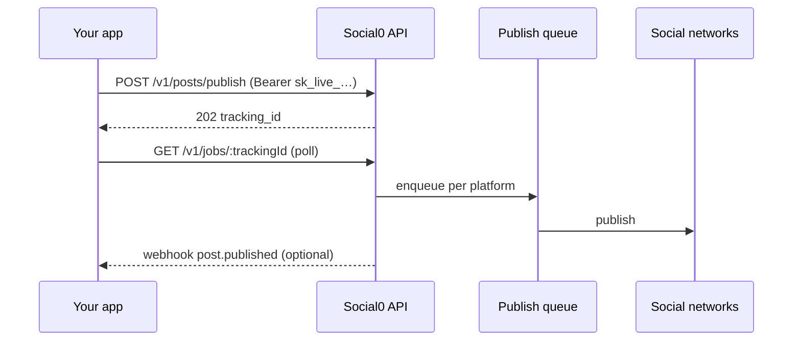

## Overview

The Social0 REST API lets you publish to LinkedIn, Instagram, X, and other platforms from your backend, CI pipeline, or automation tool. Create drafts, publish immediately, schedule posts, upload media, track publish jobs, and receive webhook notifications — all with the same publishing pipeline the dashboard uses.

**Base URL:** `https://api.social0.app`  
**Version prefix:** `/v1`  
**Authentication:** `Authorization: Bearer sk_live_…`

## How it works

1. Your app sends a publish request with an API key.
2. The API returns **202 Accepted** with a `tracking_id` (the job is queued, not live yet).
3. Poll `GET /v1/jobs/:trackingId` or subscribe to webhooks for the final outcome.
4. Social0 publishes to each connected account via the same queue and retry logic as the dashboard.

## What you can do

- **List accounts** — get connected account UUIDs for the `platforms` field
- **Create drafts** — save posts without publishing
- **Publish now** — enqueue immediate publishing
- **Schedule** — set a future `scheduledAt` (absolute instant or dashboard timezone via `+default`)
- **Upload media** — presign → PUT → confirm flow
- **Track jobs** — poll or stream publish progress
- **Receive webhooks** — `post.published`, `post.failed`, `post.scheduled`, `post.deleted`

## What you need first

1. A [Social0 account](https://social0.app)
2. At least one [connected account](/docs/dashboard/connections) (dashboard → Connections)
3. An API key from [Developer settings](/docs/dashboard/api-keys) (`sk_live_…`)

## Design principles

| Principle | Detail |
|-----------|--------|
| Per-user keys | API keys are per user — no workspace/team scoping yet |
| Same pipeline | Publishing uses the same Cloudflare queues, retries, and token refresh as the dashboard |
| Stable JSON | All `/v1` responses use **snake_case** field names |
| Error shape | `{ "error": { "code", "message" } }` on every error |
| Request tracing | Every response includes **`x-request-id`** for support |

## Not supported via API

Document these clearly before building:

- **Twitter/X OAuth connect** — requires a browser session; connect via [Dashboard → Connections](/docs/dashboard/connections)
- **Bluesky BYOK** — dashboard only (handle + app password)
- **API key scopes** — not implemented; all keys are full-access today

## Quick links

- [Quickstart](/docs/api/quickstart) — publish your first post in 5 minutes
- [MCP Server](/docs/integrations/mcp) — manage posts from Claude, Cursor, or ChatGPT
- [Authentication](/docs/api/authentication) — API keys and security
- [API Reference](/docs/api/reference) — all endpoints
- [Webhooks](/docs/api/webhooks) — event delivery and signature verification
- [OpenAPI & SDKs](/docs/api/openapi) — live Swagger UI and spec
- [Interactive docs](https://api.social0.app/docs) — Swagger UI (production)

## FAQ

| Question | Answer |
|----------|--------|
| Where do I get my API key? | [Dashboard → Developer](/docs/dashboard/api-keys) (`/dashboard/api-keys`) |
| What is `platforms` in the request body? | Array of **connected account IDs** (UUIDs from `GET /v1/accounts`), not platform names like `"linkedin"` |
| Why `Expected object, received string`? | Body was not sent as JSON — set `Content-Type: application/json` |
| What does `status: "queued"` on publish mean? | Job accepted (202); poll `GET /v1/jobs/:trackingId` for `completed` / `failed` |
| Poll or stream for job status? | **Poll** for backends/CI; **stream** optional for live UI (`GET /v1/jobs/:id/stream`) |
| Can I use the API on the free plan? | Yes; 60 requests/hour + free post limits apply |
| How do I connect accounts? | **Dashboard → Connections** (recommended). Then `GET /v1/accounts` for UUIDs. Optional: `POST /v1/accounts/connect` returns a browser OAuth URL only. |
| How do I connect Bluesky? | Dashboard only — BYOK (handle + app password). Not available via `/v1/accounts/connect`. |
| How do I connect Twitter/X? | Dashboard only (OAuth 1.0a) |
| Publish vs schedule? | `publish` enqueues immediately; `schedule` sets `scheduledAt` for cron |
| What timezone is `scheduledAt`? | Use `+default` for dashboard timezone, `timezone: "default"` with naive datetime, or UTC/offset (`Z`, `+05:30`) for absolute instants |
| How do I avoid double-posting? | Use `Idempotency-Key` on publish endpoints |
| How do I debug errors? | Note `x-request-id` header; check `error.code` in body |
| Is there a sandbox? | No separate sandbox; use a test account and draft posts |
| Will `/v1` change? | Breaking changes will ship under `/v2`; `/v1` remains stable |
