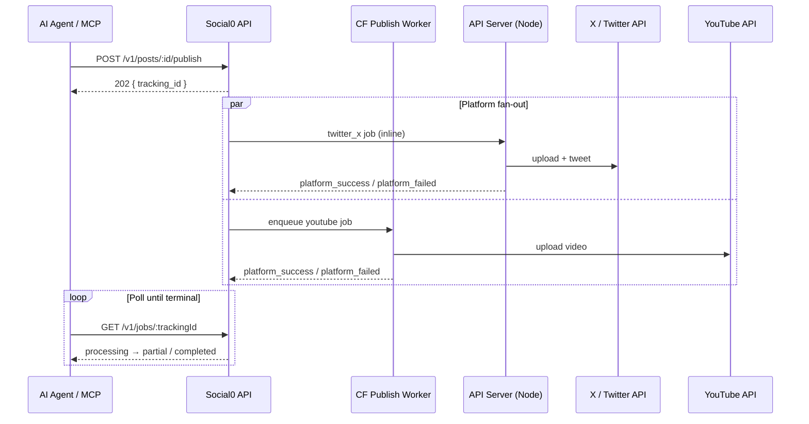

## Overview

Publishing enqueues a background job and returns a `tracking_id`. Poll [job status](/docs/integrations/api/jobs) until terminal.

**Important:** V1/MCP publish fans out to **all target platforms in parallel** — not sequentially. One `tracking_id` tracks every platform.

## Two publish paths

```text
┌─────────────────────────────────────────────────────────────┐
│ DASHBOARD (Composer → Publish)                              │
│  UI → inline executePublish() on API server (Node.js)     │
└─────────────────────────────────────────────────────────────┘

┌─────────────────────────────────────────────────────────────┐
│ V1 REST API / MCP                                           │
│  POST /v1/posts/:id/publish                                 │
│    → one async job PER platform (parallel)                  │
│    • twitter_x  → API server (Node)                         │
│    • youtube, instagram, linkedin, … → CF publish worker  │
└─────────────────────────────────────────────────────────────┘
```

MCP and REST use the V1 path. Outcome matches the dashboard; plumbing differs slightly per platform.

## Endpoints

| Method | Path | Description |
|--------|------|-------------|
| `POST` | `/v1/posts/publish` | Create + publish → **202** |
| `POST` | `/v1/posts/:id/publish` | Publish existing post → **202** |
| `POST` | `/v1/posts/schedule` | Create + schedule → **201** |
| `POST` | `/v1/posts/:id/schedule` | Schedule existing post |

## Publish now

```http
POST /v1/posts/publish
Authorization: Bearer sk_live_your_key
Content-Type: application/json
Idempotency-Key: unique-uuid

{
  "content": "Hello from the API!",
  "platforms": ["account-uuid-1", "account-uuid-2"]
}
```

**Response (202):**

```json
{
  "post_id": "uuid",
  "tracking_id": "uuid",
  "status": "queued",
  "stream_url": "/v1/jobs/{tracking_id}/stream"
}
```

`status: "queued"` means the job was **accepted** — not that the post is live yet.

## Publish existing draft

```http
POST /v1/posts/:id/publish
Idempotency-Key: unique-uuid
```

## MCP publish flow

```text
1. list_accounts                          → confirm platforms connected
2. upload_media (optional)                → media_id
3. create_draft OR publish_now             → post_id (+ tracking_id if publish_now)
4. publish_post (if draft)                → tracking_id (HTTP 202)
5. get_publish_status({ tracking_id })    → poll until terminal
6. get_post({ post_id })                  → final per-platform rows
```

## Multi-platform sequence



## Platform routing

| Platform | V1/MCP path | Notes |
|----------|-------------|-------|
| **twitter_x** | API server (Node) | Video upload via `twitter-api-v2`; same reliability as dashboard |
| **youtube** | Cloudflare worker | Large video uploads; may take minutes |
| **instagram** | Cloudflare worker | Reels/video have platform constraints |
| **linkedin, facebook, threads, tiktok, pinterest, bluesky** | Cloudflare worker | Standard queue path |

**Multiple accounts on one platform:** pass account UUID in `platforms[]`, not just `twitter_x`.

## Terminal outcomes

| Outcome | Job `status` | Post `status` |
|---------|--------------|---------------|
| All ok | `completed` | `published` |
| All failed | `failed` | `failed` |
| Mixed | `partial` | `partial` |

## What can still fail

Real platform failures happen after infrastructure fixes:

- Expired OAuth → [Reconnect in Connections](/docs/dashboard/connections)
- Platform content policy rejection
- X media size/duration limits
- YouTube quota errors

If `platform_failed` shows a platform error message, fix the underlying issue and retry.

## MCP tools

| Tool | Endpoint |
|------|----------|
| `publish_now` | `POST /v1/posts/publish` |
| `publish_post` | `POST /v1/posts/:id/publish` |
| `schedule_content` | `POST /v1/posts/schedule` |
| `schedule_post` | `POST /v1/posts/:id/schedule` |

## Full documentation

[Posts reference](/docs/api/reference/posts) · [Publish guide](/docs/api/guides/publish) · [Job status](/docs/integrations/api/jobs) · [MCP troubleshooting](/docs/integrations/mcp/troubleshooting)
