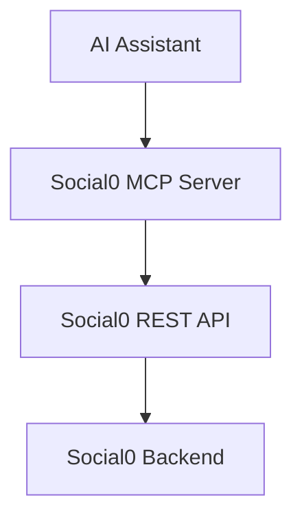

## What is the Social0 MCP server?

The Social0 MCP server is the **official Model Context Protocol integration** for Social0. It is a thin translation layer between AI assistants (Claude, Cursor, ChatGPT, VS Code) and the [Social0 REST API](/docs/api). The MCP server contains no business logic — it converts MCP tool calls into `/v1` API requests using your API key.



## What you can do

- List connected social accounts
- Create, update, delete, and list posts
- Upload images and video
- Publish immediately or schedule for later
- Track publish progress per platform (including `partial` multi-platform results)
- Get AI-native platform recommendations (`suggest_best_platforms`)

## What the MCP server is not

- **Not a replacement for the dashboard** — use the app for visual editing and account management
- **Not where OAuth happens** — connect platforms in [Dashboard → Connections](/docs/dashboard/connections) first
- **Not a separate backend** — it only calls the public REST API

## What you need before starting

1. Social0 account with at least one [connected platform](/docs/dashboard/connections)
2. [API key](/docs/dashboard/api-keys) (`sk_live_…`; legacy `s0_live_…` still accepted)
3. **Node.js 20+** installed
4. An MCP host (Claude Desktop, Cursor, VS Code, or ChatGPT)

## Quick start

```bash
git clone https://github.com/Abhishek-B-R/social0.git
cd social0/social0-mcp
cp .env.example .env
# Set SOCIAL0_API_KEY=sk_live_... in .env
npm install && npm run build
```

Then configure your MCP host — see [Quick start](/docs/integrations/mcp/quickstart) or host-specific guides below.

## Supported AI hosts

| Host | Setup guide |
|------|-------------|
| Claude Desktop | [Setup](/docs/integrations/mcp/claude-desktop) |
| Cursor | [Setup](/docs/integrations/mcp/cursor) |
| VS Code | [Setup](/docs/integrations/mcp/vscode) |
| ChatGPT | [Setup](/docs/integrations/mcp/chatgpt) |
| Windsurf | Same as Cursor (stdio MCP config) |

## Environment variables

| Variable | Required | Default | Description |
|----------|----------|---------|-------------|
| `SOCIAL0_API_KEY` | Yes | — | API key from [Developer settings](/docs/dashboard/api-keys) |
| `SOCIAL0_API_URL` | No | `https://api.social0.app/v1` | API base URL |
| `SOCIAL0_MCP_VERBOSE` | No | `false` | Log REST calls to stderr |
| `SOCIAL0_REQUEST_TIMEOUT_MS` | No | `30000` | Request timeout (ms) |
| `SOCIAL0_MAX_RETRIES` | No | `3` | Retries on HTTP 429 |

## Example prompts

Copy these into your AI assistant after MCP is configured:

```text
Show my connected Social0 accounts.
Create a LinkedIn post about AI trends in 2026.
Schedule tomorrow's product launch at 9 AM on LinkedIn and X.
Publish my latest draft.
Show all scheduled posts.
Upload ./assets/logo.png and post it to Twitter and LinkedIn.
Which platforms should I publish this to: "Just shipped v2!"
Did my post publish? Check the tracking ID from the last publish.
```

## Multi-platform publishing

MCP and REST publish **fan out to all target platforms in parallel** — not sequentially. You receive one `tracking_id`; poll `get_publish_status` until the job reaches a terminal state: `completed`, `failed`, or `partial`.

Video uploads (YouTube, X, Instagram) can take 1–5+ minutes. Poll every 2–5 seconds while status is `processing`. See [Tools reference — get_publish_status](/docs/integrations/mcp/tools#get_publish_status) and [Publish via API](/docs/integrations/api/publish).

## Links

- [Quick start](/docs/integrations/mcp/quickstart)
- [Tools reference](/docs/integrations/mcp/tools) — all 13 tools
- [API keys](/docs/dashboard/api-keys)
- [Troubleshooting](/docs/integrations/mcp/troubleshooting)
- [REST API](/docs/api) — underlying interface
- GitHub: [`social0-mcp/`](https://github.com/Abhishek-B-R/social0/tree/main/social0-mcp)

## FAQ

**Q: Do I need to pay for MCP?**  
A: MCP uses your existing Social0 plan. API access follows the same limits as your account.

**Q: Can MCP connect my Instagram or Facebook account?**  
A: No. Connect platforms in the [dashboard](/docs/dashboard/connections). MCP only posts to already-connected accounts.

**Q: Is my API key sent to Social0's servers?**  
A: Yes — the MCP server calls `api.social0.app` with your key, same as any API client. The key is stored locally in your MCP host config.

**Q: Can I use MCP on mobile?**  
A: MCP hosts are desktop apps (Claude Desktop, Cursor). Mobile is not supported today.

**Q: What's the difference between MCP and the REST API?**  
A: MCP is a translation layer for AI assistants. The REST API is the underlying interface. MCP calls REST.

**Q: What does `partial` mean for publish status?**  
A: Multi-platform publish finished with mixed results — some platforms succeeded, some failed. Check `errors` in `get_publish_status`.

**Q: What is `suggest_best_platforms`?**  
A: Analyzes your caption length and media to recommend platforms. Uses heuristics plus your connected accounts.

**Q: How long should I poll publish status?**  
A: Text posts usually finish in seconds. Video to YouTube or X can take several minutes. Poll every few seconds until `overall_status` is terminal.

**Q: Does MCP publish work the same as the dashboard Publish button?**  
A: Same outcome, slightly different plumbing. Dashboard runs on the server. API/MCP fans out per platform; X runs on the server; other platforms use a background worker.

{/* SCREENSHOT: Cursor MCP settings with social0 configured */}
{/* SCREENSHOT: Claude Desktop using list_accounts tool */}
{/* SCREENSHOT: Example publish flow with tracking ID */}
